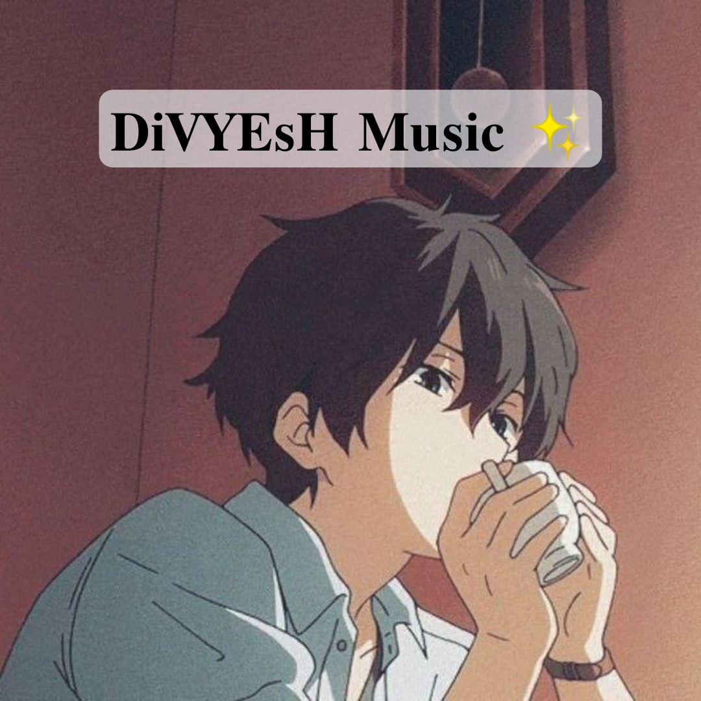

  

# TG VC USERBOT

# 

# VARS

* API_HASH - From [my.telegram.org](https://my.telegram.org)
* API_ID - From [my.telegram.org](https://my.telegram.org)
* HNDLR - Use / or .
* SESSION - [From here](https://tgsession.infotelbot.com/)
* SUDO_USERS - User ID list user counts as admin everywhere(separator using space)

# ABOUT

This is a userbot for playing VC.
Don't want BOT_TOKEN from [BOT FATHER](https://t.me/botfather)

# COMMANDS 👇

* /play - Play audio (Files or Links).
* /vplay - Play video (Files or Links).
* /stop - Stop playing.
* /playlist
# DEVS

DEV: [Divyesh Vaghela](https://t.me/zaynxop)

